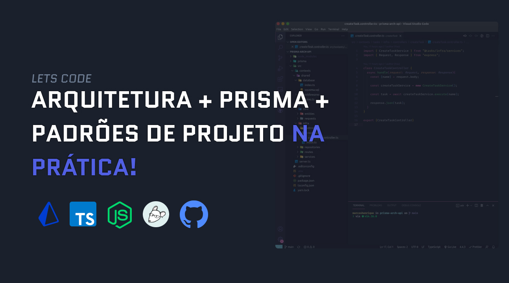

Este projeto faz parte do vídeo [*MEU FLUXO DE DESENVOLVIMENTO NO NODE*](https://www.youtube.com/watch?v=F2XQTORb-Ms&t=540s) no canal Marcos Henrique Dev

---

A ideia do projeto é mostar um pouco de um padrão de arquitetura, uso da tecnologia prisma e principalmente mostrar meu fluxo quando estou desenvolvendo uma api com node.js

link para o vídeo: [clique para abrir no youtube](https://www.youtube.com/watch?v=F2XQTORb-Ms&t=540s)

---

**feito por Marcos Henrique usando o notion ✅**
